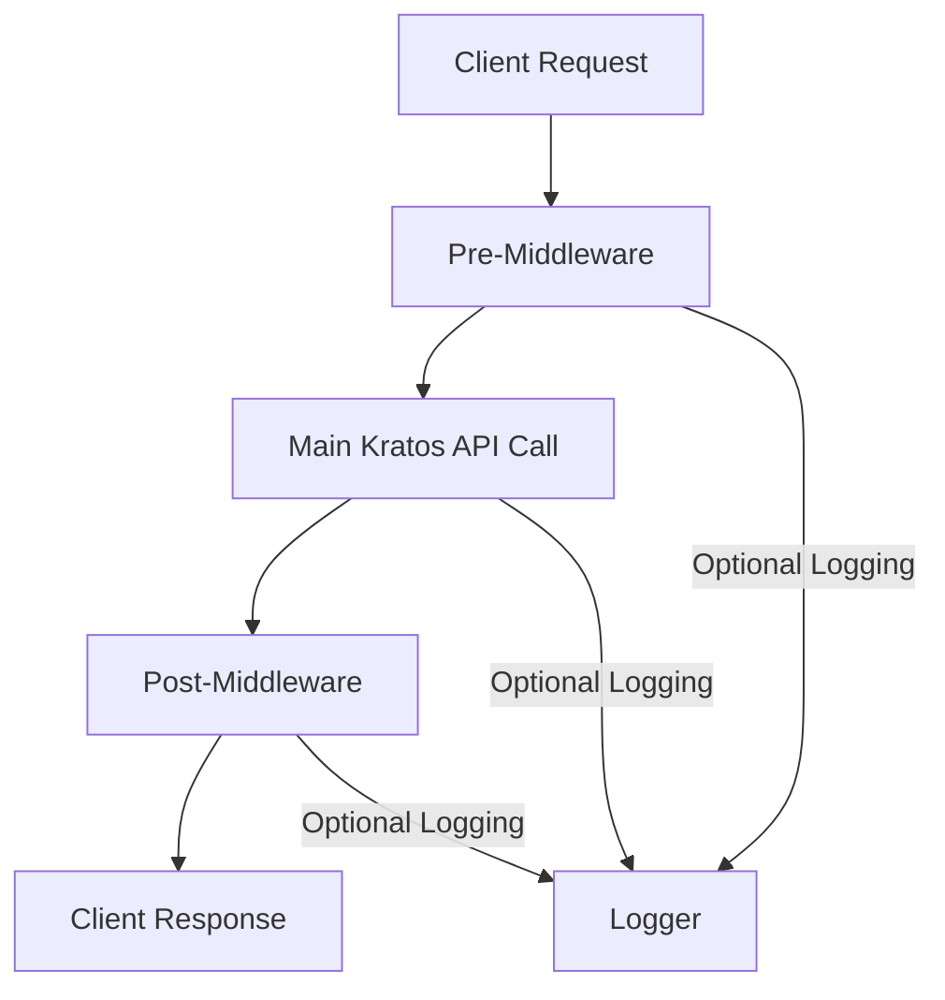
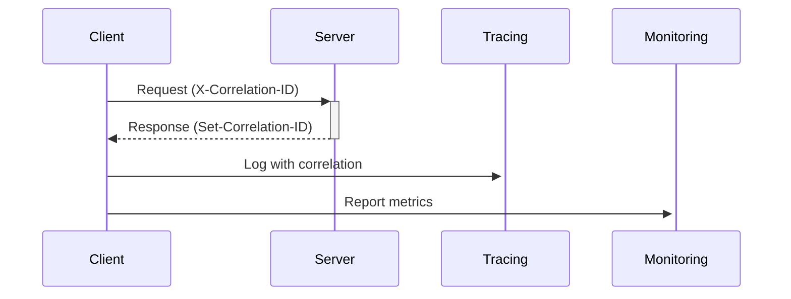
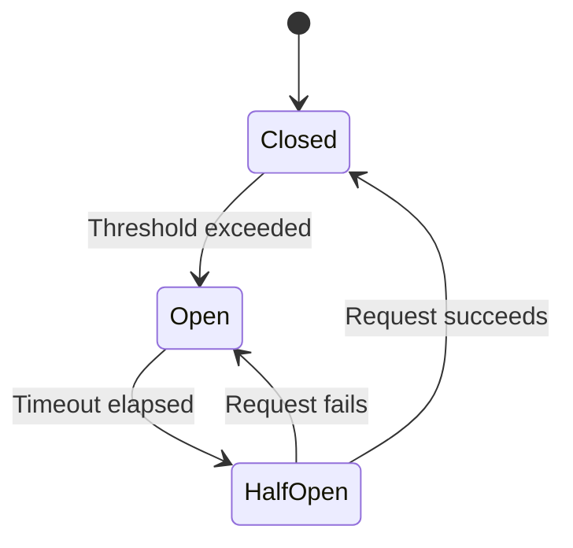

# Kratos API Client - Technical Implementation Guide

## Overview
This document describes the technical implementation of the Kratos API client with focus on reliability, observability, and resilience features. The implementation includes the KratosFetch wrapper - a modern Fetch API-based client with middleware support.

## KratosFetch API Wrapper

### Introduction
KratosFetch is a lightweight API wrapper for Ory Kratos built on the Fetch API, featuring middleware architecture and optional logging at each request stage.

### Key Features
- **Middleware Architecture**: Pre, main, and post middleware hooks
- **Optional Logging**: Configurable at each middleware stage
- **TypeScript Support**: Full type definitions
- **Error Handling**: Consistent patterns across all calls
- **Circuit Breaker**: Built-in resilience



### Basic Usage
```typescript
const kratos = new KratosFetch({
  baseUrl: 'https://kratos.example.com',
  enableLogging: true
});
const flow = await kratos.initLoginFlow();
```

[See full KratosFetch documentation](./app/lib/kratos.README.md) for detailed API reference and configuration options.

## Core Features

### 1. Observability & Tracing
- **Distributed Tracing**:
  - **Correlation ID Pattern**: 
    - Uses a cookie-like pattern with `X-Correlation-ID` header (request) and `Set-Correlation-ID` (response)
    - The correlation ID serves as the span ID for the entire request lifecycle
    - Propagated across all service boundaries and async operations
  - **Span Hierarchy**:
    - Root span created from initial correlation ID
    - Child spans inherit and extend the parent span context
    - Span context includes timing, service names, and metadata
  - **Trace Context Propagation**:
    - W3C Trace Context standard headers
    - Baggage items for additional context
    - Automatic injection into logs and metrics
- **Logging**:
  - Structured request/response logging
  - Debug mode with detailed payload inspection
  - Correlation ID inclusion in all logs

### 2. Resilience Patterns
- **Circuit Breaker**:
  - Threshold: 5 consecutive failures
  - Reset timeout: 30 seconds
  - Half-open state for gradual recovery
- **Retry Mechanism**:
  - Exponential backoff (1s, 2s, 4s)
  - Max 3 retry attempts
  - Automatic for network errors and 5xx responses

### 3. Availability Features
- **Health Checking**:
  - Built-in telemetry health checks
  - Timeout protection (2s)
  - Graceful degradation
- **Fallback Mechanisms**:
  - Basic logging when telemetry fails
  - Circuit breaker fallback states
  - Minimal viable functionality during outages

### 4. Recovery & Error Handling
- **Error Classification**:
  - Network errors (retryable)
  - Server errors (retryable)
  - Client errors (non-retryable)
- **Error Metadata**:
  - Error codes and reasons
  - Response headers preservation
  - Stack traces for debugging

## Implementation Details

### Correlation ID Flow


### Circuit Breaker State Machine


### Configuration Options
Environment Variables:
- `TELEMETRY_ENABLED`: true/false
- `TELEMETRY_SERVICE_NAME`: Service identifier
- `TELEMETRY_COLLECTOR_ENDPOINT`: Tracing endpoint
- `KRATOS_PUBLIC_URL`: API base URL

## Usage Examples

### Basic Request
```typescript
const flow = await initLoginFlow(true); // Enable debug
```

### Error Handling
```typescript
try {
  await submitLogin(flowId, credentials);
} catch (error) {
  console.error('Login failed:', error._metadata);
}
```

## Monitoring Dashboard
Recommended metrics to track:
1. Request success rate
2. Circuit breaker state
3. Average retry attempts
4. Error code distribution
5. P99 latency

## Recovery Procedures
1. **Circuit Breaker Tripped**:
   - Check dependent service health
   - Review error patterns
   - Consider manual reset if justified

2. **Telemetry Failure**:
   - Verify collector endpoint
   - Check network connectivity
   - Review client logs

3. **High Retry Rate**:
   - Investigate backend stability
   - Adjust retry parameters if needed
   - Consider rate limiting
