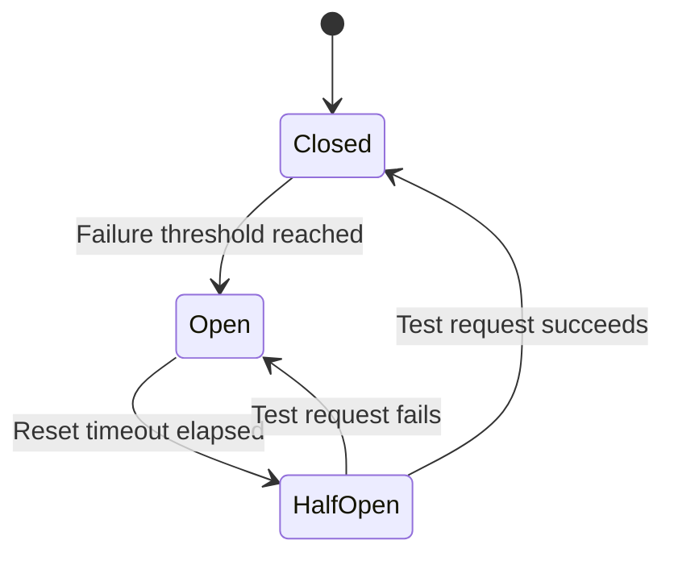

# Kratos API Wrapper Documentation

## Middleware System

The `kratosFetch` wrapper supports middleware for pre-request and post-response processing.

### Request Middleware

Request middleware functions receive the URL and request options, and return modified versions:

```typescript
type RequestMiddleware = (url: string, options: RequestInit) => [string, RequestInit]
```

Example - Adding a timestamp header:
```typescript
const timestampMiddleware: RequestMiddleware = (url, options) => {
  return [
    url,
    {
      ...options,
      headers: {
        ...options.headers,
        'X-Timestamp': Date.now().toString()
      }
    }
  ]
}
```

### Response Middleware

Response middleware functions process the response before returning:

```typescript
type ResponseMiddleware<T = any> = (response: Response) => Promise<T>
```

Example - Logging responses:
```typescript
const loggingMiddleware: ResponseMiddleware = async (response) => {
  const data = await response.clone().json()
  console.log('API Response:', data)
  return data
}
```

### Using Middleware

Pass middleware arrays to the `middlewares` parameter:

```typescript
// With both request and response middleware
const result = await kratosFetch('/endpoint', {
  method: 'GET'
}, {
  request: [timestampMiddleware],
  response: [loggingMiddleware]
})
```

## Built-in API Methods

The wrapper provides these convenience methods:

### `initLoginFlow()`
Initializes a new Kratos login flow

### `initRegistrationFlow()` 
Initializes a new Kratos registration flow

### `submitLogin(flowId: string, body: any)`
Submits a login form for the specified flow

## Error Handling

All errors are wrapped in a standardized `KratosError` format:
```typescript
interface KratosError {
  error: {
    code: number
    message: string
    reason: string
  }
}
```

## Debug Logging

All API methods support a `debug` parameter that enables comprehensive logging:

```typescript
// With debug logging enabled
await initLoginFlow(true)
await initRegistrationFlow(true) 
await submitLogin(flowId, body, true)

// With debug logging disabled (default)
await initLoginFlow()
```

Debug logging includes:
- Request method, URL and headers
- Request payload (if any)
- Response status code and headers
- Response payload
- Full error details including:
  - Error response body
  - Response headers
  - Stack traces

Logs are organized in collapsible console groups for better readability.

## Circuit Breaker

The API client implements a circuit breaker pattern to prevent cascading failures. The state machine follows these transitions:



### Configuration Parameters
- `CIRCUIT_BREAKER_THRESHOLD`: Number of consecutive failures before opening circuit (default: 5)
- `CIRCUIT_BREAKER_RESET_TIMEOUT`: Time in ms before attempting to close circuit (default: 30000)

### State Descriptions
- **Closed**: Normal operation - requests pass through
- **Open**: All requests fail fast with "Service unavailable" error
- **HalfOpen**: Allows one test request to check if service has recovered

### Test Documentation

#### Circuit Breaker Tests
1. `should block requests when circuit is open`:
   - Simulates 5 failures to trip circuit
   - Verifies subsequent requests fail fast
2. `should transition to half-open after timeout`:
   - Trips circuit with failures
   - Advances time past reset timeout
   - Verifies circuit transitions to half-open
   - Tests successful recovery

#### API Method Tests
1. `initLoginFlow should return flow data`:
   - Mocks successful response
   - Verifies flow data structure
   - Checks metadata inclusion
2. `initRegistrationFlow should return flow data`:
   - Similar to login flow test
   - Specific to registration endpoint
3. `submitLogin should handle success`:
   - Mocks successful authentication
   - Verifies resolved promise
4. `submitLogin should handle errors`:
   - Mocks 400 error response
   - Verifies error message propagation

#### Other Tests
1. `should include correlation headers`:
   - Verifies tracing headers are added
   - Checks header format
2. `should retry on network errors`:
   - Mocks initial network failure
   - Verifies automatic retry
   - Checks final success

## Configuration

Set the base URL via environment variable:
```env
KRATOS_PUBLIC_URL=http://your-kratos-instance
