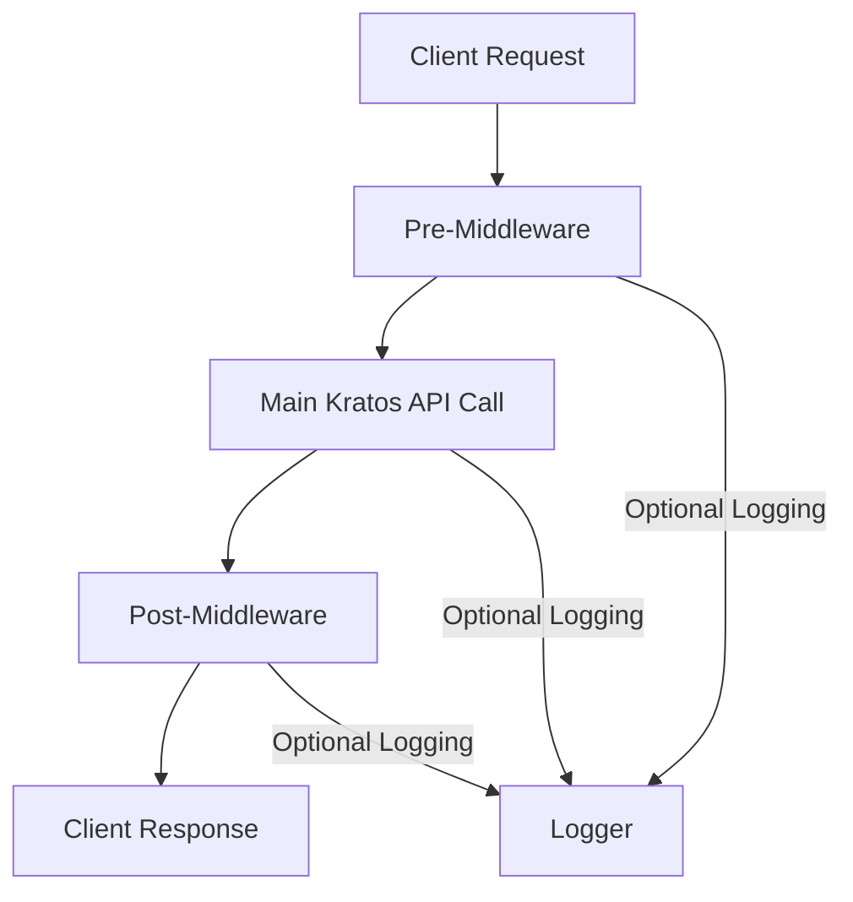

# KratosFetch API Wrapper

## Introduction

KratosFetch is a modern, lightweight server-side API wrapper for Ory Kratos. It provides a clean, middleware-based architecture for interacting with Kratos' identity management services while offering flexible logging and monitoring capabilities. 

Important: This is a server-side library and should not be used in browser environments.

## Key Features

- **Middleware Architecture**: Pre, main, and post middleware hooks for complete request lifecycle control
- **Optional Logging**: Configurable logging at each middleware stage
- **TypeScript Support**: Full type definitions for all Kratos API responses
- **Error Handling**: Consistent error handling patterns across all API calls
- **Circuit Breaker**: Built-in resilience patterns for handling service outages

## Architecture Overview



## Middleware Structure

### Pre-Middleware
- Request validation
- Authentication headers
- Request logging (optional)
- Circuit breaker check

### Main Middleware
- Actual Kratos API call
- Response type validation
- Error handling

### Post-Middleware 
- Response transformation
- Error formatting
- Response logging (optional)
- Metrics collection

## Installation

```bash
npm install @ory/kratos-client kratos-fetch
# or
pnpm add @ory/kratos-client kratos-fetch
```

## Basic Usage

```typescript
import { KratosFetch } from './kratos';

const kratos = new KratosFetch({
  baseUrl: 'https://kratos.example.com',
  enableLogging: true,
  middlewares: {
    pre: [/* custom pre-middleware */],
    post: [/* custom post-middleware */]
  }
});

// Example login flow
const flow = await initLoginFlow(true); // Enable debug logging

// Example login submission
const result = await submitLogin(flow.id, {
  identifier: "user@example.com",
  password: "password123"
});
```

## API Reference

### `initLoginFlow()`
Initializes a new login flow

**Options:**
- `returnTo`: string - URL to return to after login
- `refresh`: boolean - Refresh the flow

### `submitLogin(flowId: string, payload: LoginPayload)`
Submits login credentials

**Middleware Hooks:**
- `pre`: Validates payload structure
- `post`: Transforms error responses

## Configuration

### Environment Variables (.env)
```bash
# Kratos API Settings
KRATOS_PUBLIC_URL=http://localhost:4433
KRATOS_TIMEOUT=5000
KRATOS_RETRY_DELAY=1000
KRATOS_LOG_LEVEL=debug

# Logging Configuration
KRATOS_TIMEZONE=UTC-6  # Timezone for log timestamps
LOCALE=en-US           # Locale for timestamp formatting

# Telemetry Settings
TELEMETRY_ENABLED=true
TELEMETRY_SERVICE_NAME=kratos-client
```

### TypeScript Configuration
```typescript
interface KratosFetchConfig {
  baseUrl: string;
  enableLogging?: boolean;
  circuitBreaker?: {
    threshold: number;
    timeout: number;
  };
  middlewares?: {
    pre: Middleware[];
    post: Middleware[];
  };
}
```

## Error Handling

All errors follow the format:
```typescript
{
  status: number;
  message: string;
  details?: any;
  isNetworkError: boolean;
}
```

## Logging

KratosFetch provides server-side timestamped logging through the `KratosConsole` utility which:
- Uses Node.js crypto module for secure operations
- Formats timestamps according to configured timezone (KRATOS_TIMEZONE)
- Uses the specified locale (LOCALE) for date formatting
- Includes consistent log prefixes
- Is optimized for server environments

### Configuration
```typescript
new KratosFetch({
  enableLogging: true,
  logger: KratosConsole // Uses built-in timestamped logger
});

// Or with custom logger:
new KratosFetch({
  enableLogging: true,
  logger: {
    log: (...args) => console.log(`[CUSTOM]`, ...args),
    error: (...args) => console.error(`[CUSTOM]`, ...args)
  }
});
```

### Log Format
Example log output:
```
[2023-01-01 12:34:56] [CIRCUIT BREAKER] Transitioning to half-open state
```

## Contributing

1. Fork the repository
2. Create feature branch
3. Submit pull request

## License

MIT
